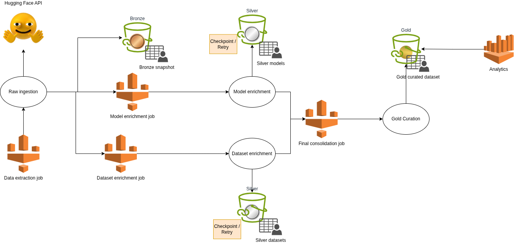

huggingface-etl-co3emissions

A reproducible, fault-tolerant ETL pipeline built on AWS Glue and PySpark to extract, enrich, and consolidate Hugging Face model metadata into a curated analytical dataset for large-scale sustainability and performance analysis.

## Overview

This project builds a production-oriented data pipeline to collect and enrich metadata from Hugging Face models that report CO2 emissions. The pipeline is designed to support reproducibility, incremental execution, fault recovery, and analytical consumption in the cloud.

The architecture follows a layered approach:

- **Bronze**: raw snapshot of Hugging Face model metadata
- **Silver Models**: enriched model-level metadata
- **Silver Datasets**: enriched dataset-level metadata
- **Gold**: curated analytical dataset ready for querying and visualization

## Objectives

- Extract Hugging Face models with reported CO2 emissions
- Enrich model metadata with model size, library, domain, training metadata, and performance information
- Enrich referenced datasets with dataset-level metadata such as dataset sizegggggggg
- Build a curated final dataset for analysis
- Ensure the pipeline is reproducible, fault-tolerant, and suitable for cloud deployment

## Architecture



```text
Hugging Face API
        |
        v
   Raw Ingestion
        |
        v
 Bronze Snapshot
    /        \
   v          v
Model       Dataset
Enrichment  Enrichment
   |          |
   v          v
Silver      Silver
Models      Datasets
    \        /
     v      v
 Final Consolidation
        |
        v
 Gold Curated Dataset
        |
        v
Analytics / Visualization

```

## Key Features

- Reproducible execution through parameterized jobs and versioned snapshots
- Fault tolerance with checkpoints, retries, and recoverable intermediate outputs
- Incremental processing to avoid unnecessary reprocessing
- Controlled parallelism for external API calls
- PySpark-based transformations for scalable joins, aggregation, normalization, and curation
- Cloud-native deployment using AWS Glue, S3, and optionally Athena and Step Functions

## Data Layers

### Bronze

Raw snapshot of Hugging Face models reporting CO2 emissions.

Typical fields:

- `model_id`
- `co2_eq_emissions`
- `downloads`
- `likes`
- `pipeline_tag`
- `library_name`
- `datasets`
- `created_at`

### Silver Models

Model-level enrichment.

Typical fields:

- `model_id`
- `model_size_mb`
- `is_autotrain`
- `training_type`
- `geographical_location`
- `hardware_used`
- `performance_metrics`

### Silver Datasets

Dataset-level enrichment.

Typical fields:

- `dataset_id`
- `dataset_size`
- optional dataset metadata

### Gold

Final curated analytical dataset combining model and dataset enrichment.

Typical fields:

- `model_id`
- `datasets`
- `datasets_size`
- `co2_eq_emissions`
- `source`
- `training_type`
- `geographical_location`
- `environment`
- `performance_metrics`
- `downloads`
- `likes`
- `library_name`
- `domain`
- `size`
- `created_at`
- `auto`

## Proposed Project Structure

```text
hf-co2-pipeline/  
├── README.md  
├── LICENSE  
├── pyproject.toml  
├── requirements.txt  
├── requirements-dev.txt  
├── src/  
│   └── hf_co2_pipeline/  
│       ├── __init__.py  
│       ├── config.py  
│       ├── entrypoints/  
│       │   └── glue_main.py  
│       ├── jobs/  
│       │   ├── raw_ingestion.py  
│       │   ├── enrich_models.py  
│       │   ├── enrich_datasets.py  
│       │   └── curate_gold.py  
│       ├── services/  
│       │   ├── hf_client.py  
│       │   ├── model_enrichment.py  
│       │   └── dataset_enrichment.py  
│       └── utils/  
│           ├── io.py  
│           ├── retry.py  
│           └── schema.py  
├── tests/  
│   ├── unit/  
│   ├── integration/  
│   └── fixtures/  
└── infra/  
    └── terraform/
```

## Workflow

### 1. Raw Ingestion

Extract a raw snapshot of Hugging Face models and persist it to S3.

### 2. Model Enrichment

Process model IDs incrementally and enrich them with model-level metadata.

### 3. Dataset Enrichment

Extract unique dataset references and enrich them separately to avoid redundant API calls.

### 4. Final Consolidation

Join Silver Models and Silver Datasets, apply schema normalization, and publish the Gold dataset.

## Fault Tolerance Strategy

The pipeline includes:

- checkpointing for long-running enrichment jobs
- retry with exponential backoff for API rate limits
- persistence of failed records for later reprocessing
- incremental execution based on processed entities
- idempotent writes where possible

## Cloud Deployment

Recommended AWS services:

- AWS Glue for ETL execution
- Amazon S3 for Bronze, Silver, and Gold storage
- AWS Glue Data Catalog for metadata management
- Amazon Athena for querying the curated dataset
- AWS Secrets Manager for Hugging Face token management
- Amazon CloudWatch for logs and monitoring
- AWS Step Functions or Glue Workflows for orchestration

## Entry Point

A single Glue entry point can dispatch specific jobs by argument:

```json
JOB_MAP = {  
    "raw_ingestion": run_raw_ingestion,  
    "enrich_models": run_enrich_models,  
    "enrich_datasets": run_enrich_datasets,  
    "curate_gold": run_curate_gold,  
}
```

Example Glue argument:

--job_name enrich_models

## Testing Strategy

This project should include:

### Unit tests

Focused on pure logic such as:

- dataset extraction
- model size computation
- CO2 metadata parsing
- metrics parsing
- schema validation
- retry behavior

### Integration tests

Focused on:

- local execution over sample parquet files
- mocked Hugging Face API responses
- end-to-end behavior of each job

Suggested tooling:

- `pytest`
- `pytest-mock`
- `coverage`
- `ruff`
- `black`

## Local Development

Install dependencies:

pip install -r requirements.txt
pip install -r requirements-dev.txt

Run tests:

pytest

Run linting:

ruff check .
black --check .

## Future Improvements

- Apache Iceberg support for transactional tables
- CI/CD pipeline for automated testing and deployment
- Terraform-based infrastructure provisioning
- data quality validation layer
- monitoring dashboards for job metrics and API failures

## Use Cases

- sustainability analysis of open ML models
- correlation analysis between CO2 emissions and model size
- study of dataset usage patterns across models
- benchmarking metadata availability and reporting quality
- analytical consumption through Athena or dashboards

## License

MIT License

Copyright (c) 2026 Juan F. Gallo

Permission is hereby granted, free of charge, to any person obtaining a copy
of this software and associated documentation files (the "Software"), to deal
in the Software without restriction, including without limitation the rights
to use, copy, modify, merge, publish, distribute, sublicense, and/or sell
copies of the Software, and to permit persons to whom the Software is
furnished to do so, subject to the following conditions:

The above copyright notice and this permission notice shall be included in all
copies or substantial portions of the Software.

THE SOFTWARE IS PROVIDED "AS IS", WITHOUT WARRANTY OF ANY KIND, EXPRESS OR
IMPLIED, INCLUDING BUT NOT LIMITED TO THE WARRANTIES OF MERCHANTABILITY,
FITNESS FOR A PARTICULAR PURPOSE AND NONINFRINGEMENT. IN NO EVENT SHALL THE
AUTHORS OR COPYRIGHT HOLDERS BE LIABLE FOR ANY CLAIM, DAMAGES OR OTHER
LIABILITY, WHETHER IN AN ACTION OF CONTRACT, TORT OR OTHERWISE, ARISING FROM,
OUT OF OR IN CONNECTION WITH THE SOFTWARE OR THE USE OR OTHER DEALINGS IN THE
SOFTWARE.
